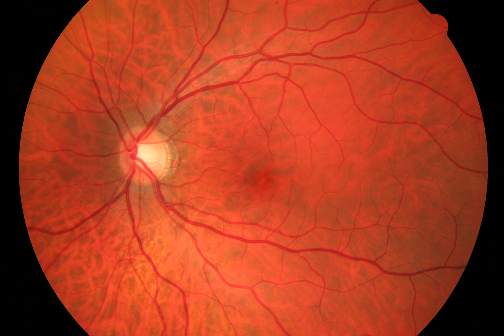
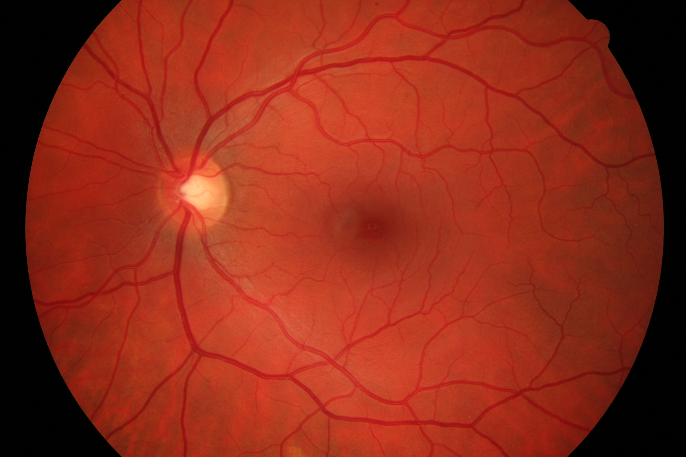

# 👁️ Retina Recognition in Java using OpenCV

This is a simple prototype for retina recognition built using **Java** and **OpenCV**. It compares two retina scan images and calculates a similarity score to determine if they belong to the same person.

---

## 🧠 How It Works

- Uses **ORB (Oriented FAST and Rotated BRIEF)** feature detection.
- Matches descriptors using **Brute Force Matcher**.
- Calculates similarity based on average feature distances.

---

## 📁 Project Structure

```
RetinaRecognitionJava/

├── Main.java              # Main class that runs the program
├── RetinaMatcher.java     # Core image matching logic
├── images/
│   ├── retina1.jpg            # First retina image (input)
│   └── retina2.jpg            # Second retina image (input)
└── README.md
```

---

## 🖼️ Sample Retina Images

(Add retina image examples here)

- `images/retina1.jpg`



- `images/retina2.jpg`



---

## 🚀 How to Run

### 🛠 Prerequisites
- Java JDK 17 or higher
- IntelliJ IDEA or VS Code
- OpenCV 4.x installed

### 🔗 Link OpenCV in Your IDE
1. Add `opencv-4.x.x.jar` to your project dependencies:
   - Located in: `C:/opencv/build/java/opencv-4.x.x.jar`
2. Set VM options to include native library:
   ```
   -Djava.library.path=C:/opencv/build/java/x64
   ```

> You must configure your IDE (IntelliJ or VS Code) to load OpenCV's native `.dll`.

---

## ▶️ Run the App

Run `Main.java`. Output example:

```
🧠 Match Score: 87.45%
✅ Retina MATCHED
```

---

## 💬 Result Interpretation

- **Score > 60%** → Likely a match ✅
- **Score < 60%** → Not a match ❌

---

## 📌 Notes

- You can replace `retina1.jpg` and `retina2.jpg` with your own retina scan images.
- Image size and quality impact detection.

---


## ✨ Made By

- Aditya  
- Himani  
- Jiya  
- Vandan

